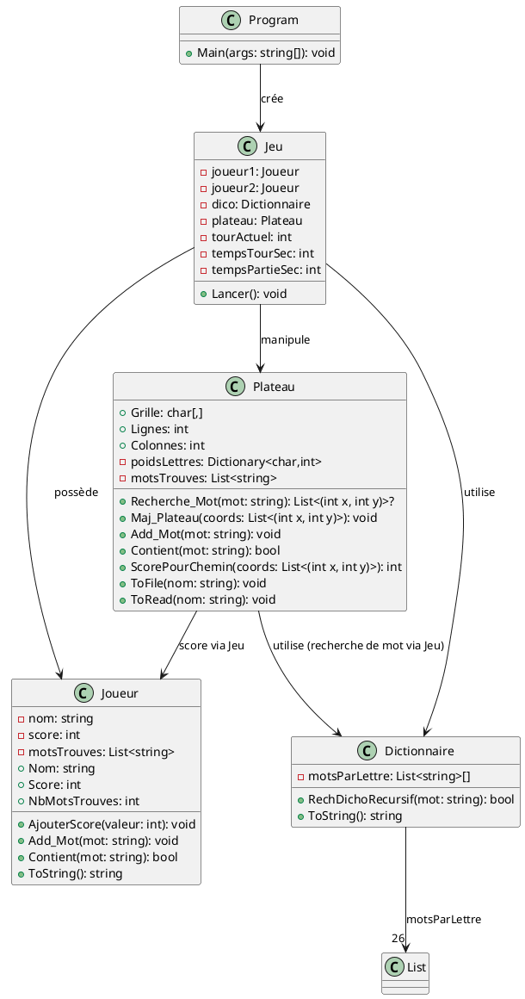

## Jeu des Mots Glissés

Petit jeu console en C# où deux joueurs s'affrontent sur un plateau de lettres façon « puissance 4 ». Le but est de trouver des mots valides présents sur le plateau et d'obtenir le meilleur score.

### Règles 
- Deux joueurs jouent à tour de rôle avec un chronomètre de 40 secondes.
- À son tour, un joueur saisit un mot (ou `STOP/stop` pour quitter).
- Le mot doit exister dans le dictionnaire (`src/txt-files/Mots_Francais.txt`) et pouvoir être lu sur le plateau en partant de la base, en remontant, puis en virant gauche/droite (sans réutiliser une même case).
- Si le mot est trouvé :
  - Le joueur marque des points = longueur du mot + poids des lettres (poids lus dans `src/txt-files/Lettre.txt`).
  - Les lettres utilisées disparaissent et les colonnes se tassent vers le bas.
- Le gagnant est celui avec le meilleur score.

### Lancement

**Depuis un terminal** : 

```bash
dotnet run
```

**Depuis visual studio** : 

1. Installer le SDK .NET 9 (ou la dernière version prise en charge par votre VS2022) puis ouvrir `MotsGlisses.csproj` via *Fichier > Ouvrir > Projet/Solution* ou en double-cliquant sur le fichier.
2. Vérifier dans la barre d'outils que la configuration est `Debug` et que le projet `MotsGlisses` est bien sélectionné comme projet de démarrage.
3. Construire avec `Ctrl+Maj+B` (*Générer > Générer la solution*) pour que les fichiers texte soient copiés dans `bin/.../src/txt-files/`.
4. Lancer le jeu avec `F5` (débogage) ou `Ctrl+F5` (sans débogage) pour ouvrir la console intégrée et jouer.

Les fichiers texte sont copiés automatiquement dans `bin/.../src/txt-files/`.

### Fichiers importants
- `src/Main.cs` : point d'entrée.
- `src/Jeu.cs` : boucle de jeu et logique des tours.
- `src/Plateau.cs` : génération/lecture du plateau, recherche de mots, mise à jour et affichage.
- `src/Dictionnaire.cs` : chargement et recherche dichotomique des mots valides.
- `src/Joueur.cs` : modèle joueur et scores.
- `src/txt-files/Mots_Francais.txt` : dictionnaire (un bloc de mots par lettre).
- `src/txt-files/Lettre.txt` : lettres, quantités max et poids (lettre,max,poids).

### Diagramme UML



### Tests unitaires (xUnit)
- Projet : `TestUnitaire` (répertoire dédié, référencé au projet principal).
- Pré-requis : restauration NuGet nécessaire (`xunit`, `Microsoft.NET.Test.Sdk`, etc.).
- Si la restauration automatique est bloquée (pas de réseau), pré-téléchargez/autorisez l’accès à `https://api.nuget.org/v3/index.json` puis exécutez :
  ```bash
  dotnet restore TestUnitaire/TestUnitaire.csproj
  ```
- Exécution des tests : placez-vous d’abord dans `src/` (ou `dir src` sous Windows) pour que les chemins relatifs fonctionnent, puis lancez :
  ```bash
  cd src
  dotnet test ../TestUnitaire/TestUnitaire.csproj
  ```
  Les tests couvrent `Dictionnaire.RechDichoRecursif`, `Plateau.Recherche_Mot`, `Plateau.Maj_Plateau`, `Plateau.ScorePourChemin` et `Joueur.Add_Mot/Contient`.
